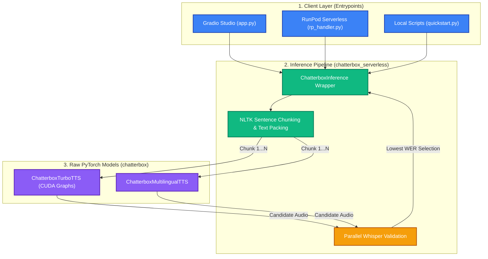
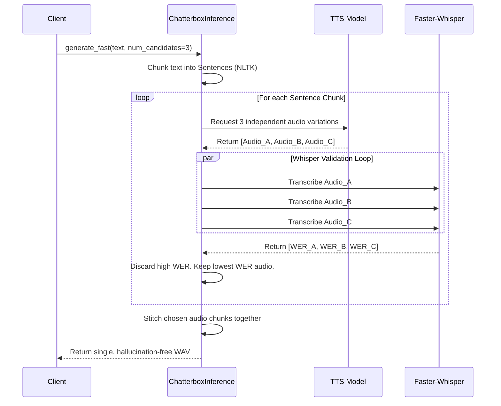

# 🏗️ Chatterbox Studio - System Architecture

This document outlines the high-level architecture of this fork, detailing how requests flow from the user interfaces down to the hardware-accelerated PyTorch models.

## 1. High-Level Flow

The system is designed with strict separation of concerns, divided into three main layers: **Client Entrypoints**, the **Pipeline Wrapper**, and the **Raw PyTorch Models**.

---

## 2. Layer Breakdown

### Layer 1: Client Entrypoints (`examples/app.py`, `rp_handler.py`)
This layer handles User Interfaces and API connections. It intentionally contains **zero logic** regarding text splitting, tensor manipulation, or validation. 
* **`app.py`:** The unified Gradio Studio. Uses a lazy-loaded Singleton pattern to hot-swap models without memory leaks.
* **`rp_handler.py`:** The RunPod serverless worker. Parses incoming JSON requests, decodes base64 audio prompts, and routes them directly to the pipeline.

### Layer 2: The Inference Pipeline (`src/chatterbox_serverless`)
This is the core "brain" of the fork. The `ChatterboxInference` class wraps the underlying PyTorch models and intercepts raw text inputs to provide robust preprocessing.
* **Text Normalization:** Converts tricky numbers and symbols into speakable words.
* **Chunking (`splitter.py`):** Uses NLTK's `sent_tokenize` to safely split paragraphs at natural boundaries, then repacks them into dense strings up to a `max_chunk_chars` limit to minimize fixed-cost inference overhead.
* **Whisper Validation (`inference.py` / `validation.py`):** Utilizes a thread-safe `ThreadPoolExecutor` to generate multiple variations of a single audio chunk and score them with `faster-whisper`. It then seamlessly stitches the lowest-WER chunks together using cross-fades and silence padding.

### Layer 3: Raw PyTorch Models (`src/chatterbox`)
This is the lowest-level hardware layer. The code here is heavily optimized for execution speed.
* **Bucketed CUDA Graphs:** Rather than dynamically executing the autoregressive loop in PyTorch, the generation sequence is traced and compiled into static C++ CUDA graphs, entirely eliminating CPU bottlenecks.
* **Flash Attention:** Upgraded to use PyTorch 2.1+ `sdpa_kernel` for memory-efficient `MultiHeadAttention`.

---

## 3. The `num_candidates` Retry Flow
A critical architectural addition in this fork is the hallucination prevention loop.

