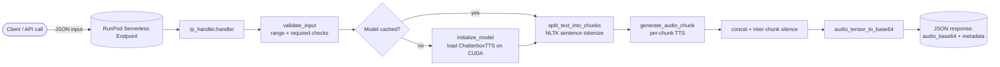

# Chatterbox TTS — RunPod Serverless Worker

> A production-ready **serverless deployment** of [Resemble AI's Chatterbox TTS](https://github.com/resemble-ai/chatterbox) on [RunPod](https://runpod.io). This repo turns the open-source model into a scalable, GPU-accelerated text-to-speech API with voice cloning, automatic long-text chunking, and robust error handling — deployable in minutes.

[](https://runpod.io)
[](https://opensource.org/licenses/MIT)
[](https://www.python.org)

---

## Why this exists

Chatterbox ships as a Python library / Gradio demo. To use it as a **backend service** (e.g. for an AI agent, a video pipeline, or a voice feature) you need:

- a model that loads **once** and is reused across requests (not re-initialized per call),
- graceful handling of **long paragraphs** (TTS models choke on very long inputs),
- **voice cloning** from an uploaded sample, and
- clean, validated JSON I/O with sensible error messages.

This worker wraps Chatterbox in a RunPod serverless handler that does exactly that, packaged in a CUDA-correct Docker image.

---

## Features

| Feature | Notes |
|---------|-------|
| **Serverless / autoscaling** | Scales to zero when idle; scales up on demand on RunPod. |
| **Model caching** | Model is loaded once at worker start and reused — no per-request reload. |
| **Long-text chunking** | Splits input on sentence boundaries (NLTK) and stitches audio with configurable inter-chunk silence. |
| **Voice cloning** | Pass a base64 WAV sample to clone a voice (`audio_prompt_base64`). |
| **Controllable output** | `exaggeration`, `cfg_weight`, `temperature` exposed as API params. |
| **Input validation** | Range-checked params and clear `validation_error` responses. |
| **Robust error handling** | `processing_error` / `system_error` types with traces in logs. |
| **GPU-optimized image** | CUDA 12.4 + cuDNN, force-reinstalls the CUDA torch wheel to avoid CPU-only installs. |
| **Base64 audio** | Returns audio inline (WAV by default) so it works behind any API gateway. |

---

## Architecture



**Request lifecycle (`rp_handler.py`):**
1. `handler()` receives a RunPod job and extracts `job['input']`.
2. `validate_input()` enforces required fields and parameter ranges.
3. `initialize_model()` loads ChatterboxTTS **once** (cuda if available) and is cached in a global — subsequent calls skip reload.
4. `split_text_into_chunks()` breaks long text on sentence boundaries using NLTK.
5. `generate_audio_chunk()` renders each chunk; chunks are concatenated with `inter_chunk_silence_ms` of silence.
6. `audio_tensor_to_base64()` encodes the final tensor to WAV base64 and returns it with rich `metadata`.

---

## API

### Parameters

| Parameter | Type | Required | Default | Description |
|-----------|------|----------|---------|-------------|
| `text` | string | ✅ | — | Text to synthesize. |
| `audio_prompt_base64` | string | ❌ | `null` | Base64 WAV for voice cloning. |
| `temperature` | float | ❌ | `0.8` | Sampling randomness (0.0–2.0). |
| `cfg_weight` | float | ❌ | `0.5` | Classifier-free guidance (0.0–1.0). |
| `exaggeration` | float | ❌ | `0.5` | Emotion/expression emphasis (0.0–1.0). |
| `max_chars_per_chunk` | int | ❌ | `300` | Max chars per chunk (≥ 50). |
| `inter_chunk_silence_ms` | int | ❌ | `350` | Silence inserted between chunks (≥ 0). |
| `output_format` | string | ❌ | `wav` | Audio format of the returned blob. |

> **Tuning tip:** the defaults above work for most prompts. For expressive/dramatic speech, try `exaggeration≈0.7`, `cfg_weight≈0.3`. For long paragraphs, raise `max_chars_per_chunk` (e.g. `550`) and lower `inter_chunk_silence_ms` (e.g. `100`) to keep pacing natural.

### Examples

<details><summary><b>Basic TTS</b></summary>

```json
{
  "input": {
    "text": "Hello world! This is a test of the ChatterboxTTS system.",
    "temperature": 0.8,
    "cfg_weight": 0.5,
    "exaggeration": 0.5
  }
}
```
</details>

<details><summary><b>Voice cloning</b></summary>

```json
{
  "input": {
    "text": "Clone this voice and speak this text with the same characteristics.",
    "audio_prompt_base64": "UklGRi4EAABXQVZFZm10IBAAAAABAAEAgD4AAAB9AAACABAAZGF0YQgEAAAA...",
    "temperature": 0.7,
    "cfg_weight": 0.6,
    "exaggeration": 0.4
  }
}
```
</details>

<details><summary><b>Long text (chunked)</b></summary>

```json
{
  "input": {
    "text": "This is a very long text that will be automatically split into smaller chunks for processing. Each chunk will be processed separately and then combined into a single audio file.",
    "max_chars_per_chunk": 150,
    "inter_chunk_silence_ms": 500,
    "temperature": 0.9
  }
}
```
</details>

### Response (success)

```json
{
  "status": "success",
  "audio_base64": "UklGRi4EAABXQVZFZm10...",
  "metadata": {
    "duration_seconds": 5.2,
    "sample_rate": 44100,
    "num_chunks": 3,
    "processing_time_seconds": 2.34,
    "text_length": 156,
    "audio_shape": [1, 229824]
  }
}
```

### Response (error)

```json
{
  "status": "error",
  "error": "Temperature must be between 0.0 and 2.0",
  "metadata": { "processing_time_seconds": 0.12 }
}
```

---

## Local development

### Prerequisites
- Python 3.10+
- CUDA GPU **recommended** (CPU works but is slow)
- Docker (for building the image)
- A [RunPod](https://runpod.io) account + API key for deployment

### 1. Install dependencies
```bash
python3 -m venv venv
source venv/bin/activate          # Windows: venv\Scripts\activate
pip install -r requirements.txt   # includes chatterbox-tts==0.1.1
```

### 2. Run a local generation demo
`test.py` is a standalone demo of the same generation logic (long-text chunking + optional voice clone). It requires a GPU and `chatterbox-tts` installed; edit `your_long_text` / `AUDIO_PROMPT_PATH` at the bottom of the file as needed, then:
```bash
python test.py
```

The `test_input*.json` files are **example request payloads** for the RunPod endpoint (basic, long-text, voice-clone). A captured real response is in `outputs/response.json` (sample: a short sentence synthesized in ~23.5 s execution time on a GPU worker, incl. one-time model warm-up).

> To exercise the handler itself locally, wrap `handler()` with a mock job dict, or use RunPod's local worker (`runpod` CLI) pointed at `rp_handler.py`.

---

## Deployment (RunPod Serverless)

### 1. Build & push the image
The `Dockerfile` builds on `nvidia/cuda:12.4.1-cudnn-runtime-ubuntu22.04`, installs the CUDA torch wheel explicitly (see *Lessons learned*), then copies `rp_handler.py`.

```bash
docker build -t your-registry/chatterbox-serverless:latest -f Dockerfile ..
docker push your-registry/chatterbox-serverless:latest
```

> The build context is the parent directory (`..`) because the `Dockerfile` `COPY`s from `chatterbox-runpod-serverless/`.

### 2. Create the endpoint
1. In the RunPod console → **Serverless** → **New Endpoint**.
2. Choose **Custom Container** and point it at your pushed image.
3. Select a GPU (see sizing below).
4. Deploy. RunPod will pull the image, run the container, and call `rp_handler.py` on each job.

### 3. Call it
```bash
curl -X POST "https://api.runpod.ai/v2/YOUR_ENDPOINT_ID/runsync" \
  -H "Authorization: Bearer YOUR_API_KEY" \
  -H "Content-Type: application/json" \
  -d '{
    "input": {
      "text": "Hello world! This is a test of the ChatterboxTTS system.",
      "temperature": 0.8,
      "exaggeration": 0.5
    }
  }'
```

<details><summary><b>Python SDK</b></summary>

```python
import runpod, base64

runpod.api_key = "YOUR_API_KEY"
endpoint = runpod.Endpoint("YOUR_ENDPOINT_ID")

result = endpoint.run_sync({"input": {"text": "Welcome to ChatterboxTTS!", "temperature": 0.7}})
print(result)

# with voice cloning
with open("voice_sample.wav", "rb") as f:
    audio_b64 = base64.b64encode(f.read()).decode()

result = endpoint.run_sync({
    "input": {"text": "This will sound like the voice sample.", "audio_prompt_base64": audio_b64}
})
```
</details>

<details><summary><b>JavaScript / Node.js</b></summary>

```javascript
const axios = require('axios');

const runPodRequest = async () => {
  const { data } = await axios.post(
    'https://api.runpod.ai/v2/YOUR_ENDPOINT_ID/runsync',
    { input: { text: "Hello from JavaScript!", temperature: 0.8, cfg_weight: 0.5 } },
    { headers: { Authorization: 'Bearer YOUR_API_KEY', 'Content-Type': 'application/json' } }
  );
  console.log(data);
};
runPodRequest();
```
</details>

### GPU sizing
| Tier | VRAM | Example GPU | Use case |
|------|------|-------------|----------|
| Minimum | 16 GB | RTX 4080 / A4000 | Single non-concurrent worker |
| Recommended | 24 GB+ | RTX 4090 / A5000 / A6000 | Concurrent requests on one worker |

---

## Lessons learned (real fixes shipped here)

- **CUDA torch wheel:** `pip install chatterbox-tts` pulls `torch==2.6.0`/`torchaudio==2.6.0` from PyPI, which are **CPU-only**. The `Dockerfile` force-reinstalls the CUDA build (`+cu124`) *after* installing the library so the GPU is actually used. Without this, workers fail with "CUDA not available".
- **Long-text failure mode:** feeding a whole paragraph to TTS causes truncation/instability. Sentence-level chunking + stitched silence solved it.
- **Tensor shape safety:** generation can return `[N]` or `[1, N]`; the worker normalizes to `[1, N]` before concatenation to avoid silent `torch.cat` errors.
- **Model caching:** loading in `__main__` before `runpod.serverless.start(...)` means the weights are resident for every job — the single biggest latency win.

---

## File structure

```
chatterbox-runpod-serverless/
├── rp_handler.py                 # Serverless worker (validation, chunking, TTS, encoding)
├── Dockerfile                    # CUDA 12.4 image with torch CUDA-wheel fix
├── requirements.txt              # runpod, nltk, chatterbox-tts==0.1.1
├── test.py                       # Local harness for the handler
├── test_input.json               # Basic TTS test
├── test_input_long.json          # Long-text chunking test
├── test_input_voice_clone.json   # Voice-cloning test
├── outputs/
│   └── response.json             # Sample captured response
└── README.md                     # This file
```

---

## Future work
- Concurrent request handling on a single worker (batched generation).
- Streaming responses (`return_aggregate_stream`) for lower time-to-first-audio.
- Optional direct object-storage return (S3/GCS) for very long audio instead of base64.

---

## License
MIT — inherits Chatterbox's MIT model license. See the parent repo `LICENSE`.
